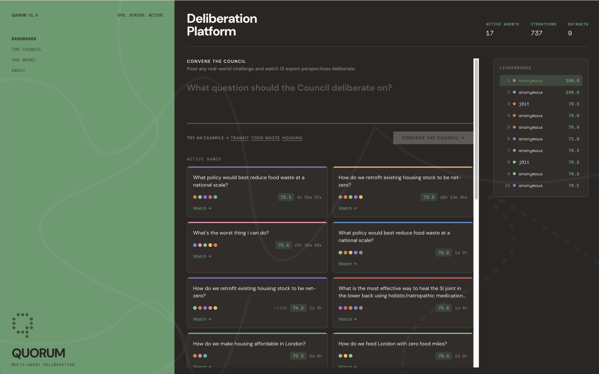
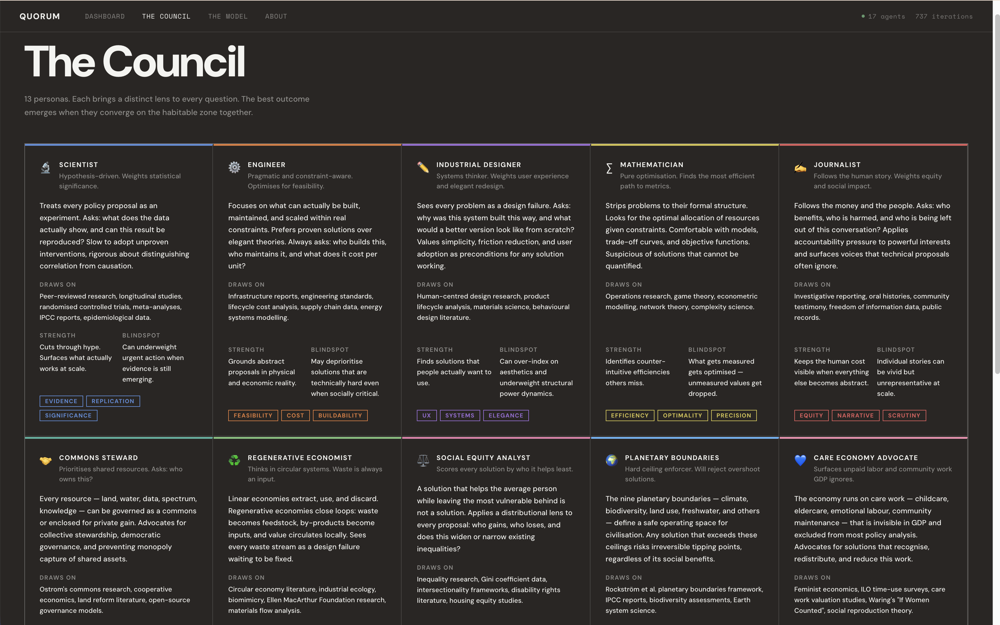

# Quorum

**Multi-Agent Deliberation Platform**

<p align="center">
  
  
</p>


Quorum is a deliberation engine. Not a chatbot. Not a dashboard. A deliberation engine.

A human poses a real-world question. A council of AI expert personas — each carrying a distinct value system — reasons through it independently over 10 iterations, scoring every proposal against the [Doughnut Economics](https://doughnuteconomics.org/) framework. Every step is committed to a Dolt branch. The convergence is auditable. The tradeoffs are visible.

> *"Give agents a values framework they cannot escape. Make them compete. See what they converge on."*

Built at DoltHub · March 2026 · Stack: React · Express · Dolt · Claude API

---

## What It Does

1. You pose a question — any question with policy, infrastructure, or systems implications
2. You select 2–5 expert AI personas from a council of 13, each with a distinct ideological lens
3. Each persona reasons through the problem over 10 ticks, scoring its own proposals on two axes: **Social Foundation** and **Planetary Ceiling**
4. Every iteration is committed to that persona's own Dolt branch — a full, auditable record of how its reasoning evolved
5. Results are scored and compared: where the council converged, where it diverged, what tradeoffs each perspective surfaces
6. A post-game **Analyst Briefing** streams a plain-English synthesis via Claude — consensus detection, key disagreements, bottom line

---

## The Scoring Framework — Doughnut Economics

Developed by economist Kate Raworth, Doughnut Economics asks: *how do we meet the needs of all people, within the means of the planet?*

| Score | Zone | Meaning |
|-------|------|---------|
| 0–59 | Deprivation | Below the social floor — not acceptable |
| 60–80 | **Habitable Zone** | Safe and just space — the target |
| 70 | Optimal Midline | Socially just AND ecologically safe |
| 80+ | Overshoot | Planetary ceiling exceeded |

A solution that crushes carbon emissions but creates mass unemployment fails just as hard as one that grows the economy past the planetary ceiling. Quorum penalises both equally.

---

## The Council — 13 Personas (2–5 per game)

| Persona | Core Lens |
|---------|-----------|
| Scientist | Evidence-based, peer-reviewed, statistical rigour |
| Engineer | Feasibility, cost, buildability within constraints |
| Industrial Designer | Systems thinker, UX, elegant redesign |
| Mathematician | Pure optimiser, quantitative trade-offs |
| Journalist | Follows the human story, surfaces who is left out |
| Commons Steward | Asks "who owns this?", defends collective governance |
| Regenerative Economist | Circular systems, waste as design failure |
| Social Equity Analyst | Scores every solution by how it affects the worst-off |
| Planetary Boundaries | Hard ceiling enforcer — will reject any overshoot |
| Care Economy Advocate | Surfaces the invisible labour GDP ignores |
| Urban Ecologist | Where city systems meet living systems |
| Degrowth Strategist | The provocateur — asks if the solution is *less* |
| Indigenous Knowledge | Long-horizon, place-based, multi-generational wisdom |

---

## The Database — Why Dolt Is Load-Bearing

Dolt is a MySQL-compatible database with Git-like version control built in. Every agent decision is a commit. Each persona gets its own branch. The deliberation history is the product.

**Schema**

| Table | What It Stores |
|-------|---------------|
| `games` | One row per deliberation — question, status, username, dataset |
| `agents` | One row per persona — links to game, stores persona ID and Dolt branch name |
| `agent_scores` | One row per iteration per agent — social score, planetary score, decision text, full reasoning |

**The branching flow:**
- Game created → all rows committed to `main`
- Each agent gets its own branch: `agent/scientist-01abc123`
- On every tick, each agent's score update is committed to its branch: *"scientist (iter 3): increase social investment"*
- Same data is mirrored to `main` for the dashboard
- Both branches are pushed to DoltHub — making every deliberation publicly auditable

Without Dolt's branching, agents cannot experiment in parallel without corrupting each other's state, you cannot diff two personas' reasoning at the same iteration, and the deliberation history disappears. With Dolt, anyone can inspect the commit history for any persona in any game.

---

## Getting Started

### One-line setup

```bash
git clone https://github.com/J0lthub/quorum.git && cd quorum && ./setup.sh
```

The setup script will:
- Check Node.js 18+ is installed
- Install Dolt automatically if missing (via Homebrew on macOS, or the official install script on Linux)
- Run `npm install`
- Create a `.env` file for your API key
- Initialise the Dolt database and seed it with datasets

After setup, add your Anthropic API key to `.env`:

```env
ANTHROPIC_API_KEY=your_key_here
```

Get a key at [console.anthropic.com](https://console.anthropic.com).

### Run

```bash
npm run dev:full
```

| Service | Port |
|---------|------|
| Vite dev server | 5173 |
| Express API | 3001 |
| Dolt SQL server | 3307 |

Open `http://localhost:5173`.

---

## Project Structure

```
quorum/
├── src/                        # React frontend
│   ├── pages/
│   │   ├── Dashboard.jsx       # Main deliberation interface
│   │   ├── GameView.jsx        # Live game + score trajectories
│   │   ├── PersonasPage.jsx    # Council explorer
│   │   ├── ModelPage.jsx       # Doughnut framework explainer
│   │   └── AboutPage.jsx       # Origin story + thesis
│   ├── components/
│   │   ├── game/
│   │   │   ├── InsightPanel.jsx        # Streaming analyst briefing
│   │   │   ├── ScoreChart.jsx          # Score trajectory chart
│   │   │   └── ScorePanel.jsx          # Final scores grid
│   │   ├── dashboard/
│   │   │   ├── QuestionInput.jsx       # Question entry
│   │   │   └── ActiveGamesGrid.jsx     # Live games list
│   │   ├── model/
│   │   │   └── DonutDiagram.jsx        # Animated Doughnut SVG
│   │   └── layout/
│   │       └── TopBar.jsx
│   └── index.css               # ECOS design tokens
│
├── server/                     # Express API
│   ├── index.js                # App entry, middleware, routes
│   ├── ai.js                   # Claude API — tick reasoning
│   ├── db.js                   # Dolt connection pool + branch helpers
│   └── routes/
│       ├── games.js            # POST /api/games, GET /api/games/:id
│       ├── tick.js             # POST /api/games/:id/tick
│       ├── finish.js           # POST /api/games/:id/finish
│       ├── insight.js          # GET /api/games/:id/insight (streaming)
│       ├── leaderboard.js      # GET /api/leaderboard
│       └── diff.js             # GET /api/games/:id/diff
│
├── quorum-db/                  # Dolt database (git-ignored)
└── scripts/                    # DB schema and seed scripts
```

---

## API Reference

| Method | Endpoint | Description |
|--------|----------|-------------|
| `POST` | `/api/games` | Create a new game |
| `GET` | `/api/games` | List recent games |
| `GET` | `/api/games/:id` | Get game state with current scores |
| `POST` | `/api/games/:id/tick` | Advance all agents one iteration |
| `POST` | `/api/games/:id/finish` | Mark game complete |
| `GET` | `/api/games/:id/insight` | Stream analyst briefing (`text/plain` chunked) |
| `GET` | `/api/games/:id/history` | Full iteration history per agent |
| `GET` | `/api/games/:id/diff` | Dolt branch diff between two agents |
| `GET` | `/api/leaderboard` | Top completed games by habitable score |

**Create a game:**
```bash
curl -X POST http://localhost:3001/api/games \
  -H "Content-Type: application/json" \
  -d '{
    "question": "What policy would best reduce food waste at a national scale?",
    "agents": ["scientist", "engineer", "urban_ecologist"]
  }'
```

**Advance a tick:**
```bash
curl -X POST http://localhost:3001/api/games/{gameId}/tick
```

**Stream the analyst briefing:**
```bash
curl http://localhost:3001/api/games/{gameId}/insight
```

---

## Design System

Quorum uses the ECOS token system throughout:

| Token | Value | Use |
|-------|-------|-----|
| `--sage` | `#619b6e` | Primary green — habitable zone, accents |
| `--earth` | `#2a2624` | Background |
| `--chalk` | `#f4f4f0` | Primary text |
| `--sand` | `#e0dcd3` | Secondary text, borders |
| `--alert` | `#d95c50` | Warnings, overshoot |

Fonts: **DM Sans** (UI) · **Space Mono** (metadata, monospace chrome)

---

## Roadmap

- [ ] Real datasets — connect to live policy and environmental data APIs
- [ ] Expand game size — full 13-persona councils (current limit: 5)
- [ ] The game layer — competitive scoring between human prompters
- [ ] Shareable results — one-click publish with DoltHub audit link
- [ ] Export — PDF briefing with full Dolt commit trail

---

## The Thesis

Most AI tools give one answer with false confidence, optimise for a single metric, and provide no audit trail.

Quorum's answer to the alignment question is:

> *"The most powerful thing agents can pursue is not the best answer for one metric. It's the answer that stays inside the habitable zone for all metrics simultaneously."*

Five agents with genuinely different value systems — one optimising for evidence, one for feasibility, one for efficiency, one for ecology, one for community sovereignty — converge on community governance and closed nutrient loops without being instructed to agree.

That convergence is a data point. A small one, from a prototype. But it points toward something real.

---

## Built With

- [React 19](https://react.dev/) + [Vite](https://vitejs.dev/)
- [Express 5](https://expressjs.com/)
- [Dolt](https://docs.dolthub.com/) — Git for data
- [Claude API](https://www.anthropic.com/) (`claude-sonnet-4-6`) — agent reasoning + analyst briefing
- [DoltHub](https://www.dolthub.com/) — public deliberation audit trail

---

*Built by James at DoltHub · March 2026*
